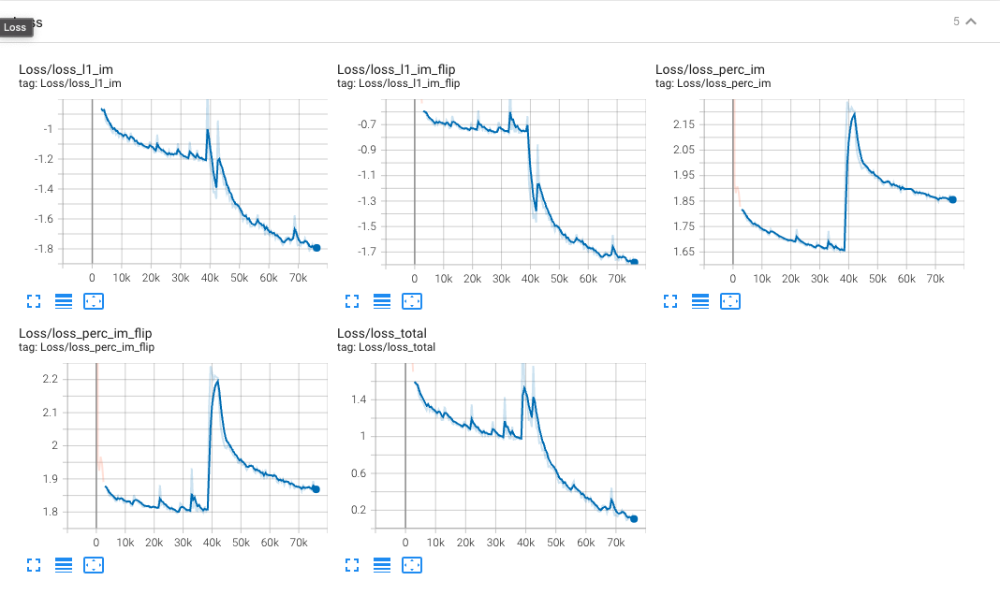
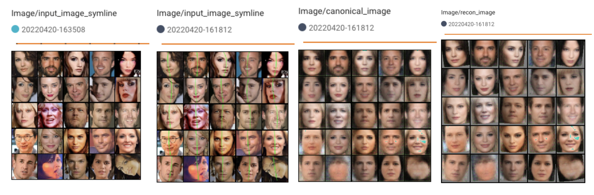
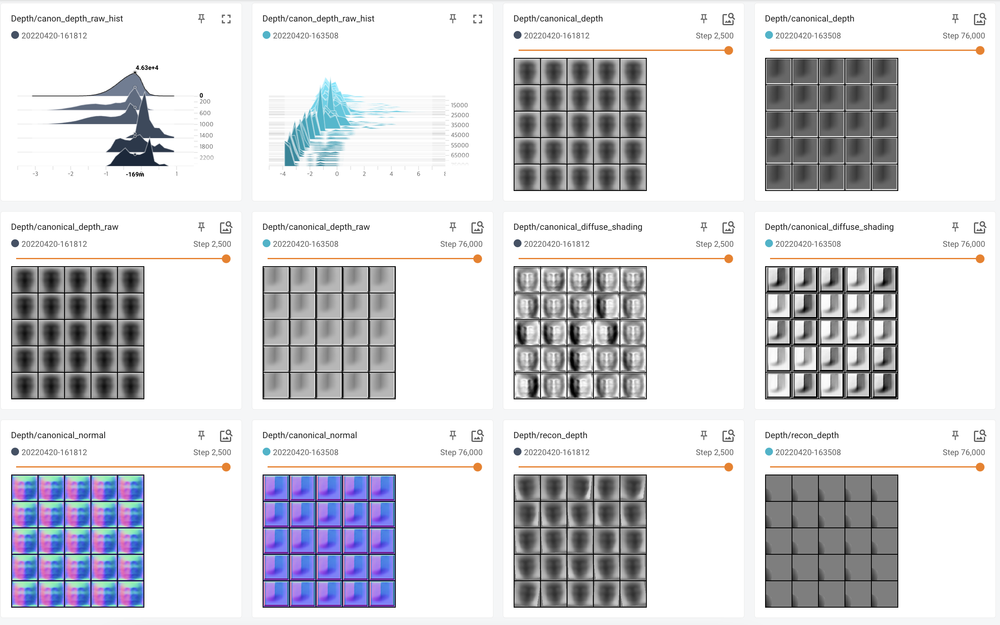

# unsup3d-replication
Replication of Unsup3D originally from [Unsup3D](https://github.com/elliottwu/unsup3d)
### Training Unsup3D on CelebA Dataset
1. Install dependencies from [Unsup3D](https://github.com/elliottwu/unsup3d)
* Download neural_renderer from [here](https://github.com/adambielski/neural_renderer) instead of the original repository.
2. I trained the model with the following configurations:
* python==3.8.3
* torch==1.9.0+cu111
3. Download the CelebA Dataset from [here](https://drive.google.com/drive/folders/0B7EVK8r0v71pTUZsaXdaSnZBZzg?resourcekey=0-rJlzl934LzC-Xp28GeIBzQ)
```
# 1) Download img_celeba.7z folder from Google Drive
# 2) Extract the .7z file
$ 7za x img_celeba.7z
```

4. Train the model
```
python run.py --config experiments/train_celeba.yml --gpu 0 --num_workers 4
```
5. Check the results in Tensorboard
* Logs are stored in results/celeba/logs/
* From you local machine, run
```
ssh -N -f -L localhost:16006:localhost:6006 <user@remote>
```
* On the remote machine, run
```
tensorboard --logdir results/logs --port 6006
```
* See Tensorboard in http://localhost:16006/

#### Training Loss


#### Reconstruction Pipeline


#### Depth
